# Anti-Dump Algorithm (ADI)

> **Weeding out the nonsense and fostering clarity.**  
> *We measure "Dumpiness" by quantifying Noise vs. Effort, Context, and Details.* 😅


## The Core Problem: Why My Wallet Started Crying

When you're building an app with AI, you quickly learn a hard truth: people will send you all kinds of "dumpy" inputs. Vague, low-effort requests that cost you money because your expensive AI models still have to process them. It's the digital equivalent of someone shouting "ASAP!!!" at the bouncer. For me, this "Dummheit" (stupidity) started hitting my wallet directly, and I had to do something about it.

## The Solution: My Digital 🇹🇷-Bouncer from Germany 😄

Inspired by my Turkish roots, I created a mathematical framework to act as a bouncer for my applications. This is the Anti-Dump Index (ADI). Its job is simple: check the quality of every single request at the door. If it's a good, high-quality request, it gets in. If it's "dump" – a waste of time and money – my bouncer has one simple rule:

"Ej, du kommst hier net rein!"

This phrase, which roughly translates to "Hey, you're not getting in here!", is a legendary saying in Germany. It’s what you'd often hear from bouncers at nightclubs, particularly those with a Turkish background, and it's a nostalgic joke for anyone who grew up here.  It brings me joy to think of my code having its own bouncer to protect my developer wallet.

This project isn't a full app; it's a showcase for this logic. It's the technical manifestation of a developer's frustration, turned into a powerful, cost-saving solution.


## Purpose
The **Anti-Dump Algorithm** calculates the **ADI (Anti-Dump Index)** to evaluate input quality by measuring:
- **Noise**: Irrelevant content (e.g., "URGENT!!!", "plz help")
- **Effort**: Clarity/structure
- **Context**: Background information (OS, framework)
- **Details**: Technical depth (error messages, code snippets)

```math
ADI = \frac{w_N \cdot \text{Noise} - (w_E \cdot \text{Effort} + w_B \cdot \text{Bonus})}{w_C \cdot \text{Context} + w_D \cdot \text{Details} + w_P \cdot \text{Penalty}}
```

### Key Parameters
| Parameter | Description | Example |
|-----------|-------------|---------|
| **Noise** | Irrelevant words/phrases | "ASAP", "???" |
| **Effort** | Structure/clarity | Complete sentences, formatting |
| **Context** | Environment info | "Python 3.9 on Windows" |
| **Details** | Technical specifics | Error logs, code snippets |
| **Bonus** | Positive elements | Code blocks, precise terms |
| **Penalty** | Negative elements | ALL CAPS, excessive "!!!" |

<details>
<summary><strong>Table of Contents</strong></summary>

1. [Core Concepts](#1-core-concepts)  
2. [Formula Explained](#2-formula-explained)  
3. [Quality Zones](#3-quality-zones)  
4. [Advanced Metrics](#4-advanced-metrics)  
5. [Real-World Examples](#5-real-world-examples)  
6. [Practical Implementation](#6-practical-implementation)  
7. [Integration Guide](#7-integration-guide)  
8. [Full Code](#8-full-code)  
9. [Extended Logic](#9-extended-logic)  
10. [FAQs](#10-faqs)  
11. [License](#11-license)
</details>

---

## 1. Core Concepts

### Why ADI Matters
- **Vague requests** waste resources: "Help plz urgent!!!"
- **Missing details** delay solutions (no error messages/code)
- **AI costs** accumulate processing low-value input

### How ADI Works
1. **Quantify** input components (Noise, Effort, etc.)
2. **Calculate** ADI score using weighted formula
3. **Classify** into quality zones:
   - 🟥 `ADI > 1`: Reject (High dumpiness)
   - 🟨 `0 ≤ ADI ≤ 1`: Medium priority
   - 🟩 `ADI < 0`: Prioritize (High quality)

---

## 2. Formula Explained

### Base Formula (Simplified)
```math
\text{ADI} = \frac{\text{Noise} - \text{Effort}}{\text{Context} + \text{Details}}
```

### Full Formula (Weighted)
```math
ADI = \frac{w_N \cdot \text{Noise} - (w_E \cdot \text{Effort} + w_B \cdot \text{Bonus})}{w_C \cdot \text{Context} + w_D \cdot \text{Details} + w_P \cdot \text{Penalty}}
```

**Weights** customize for different use cases:
```python
weights = {
    "noise": 1.0, 
    "effort": 2.0, 
    "context": 1.5,
    "details": 1.5,
    "bonus": 0.5,
    "penalty": 1.0
}
```

---

## 3. Quality Zones


### Interpretation Guide
| Zone | ADI Range | Action | Characteristics |
|------|-----------|--------|-----------------|
| **Dump Zone** | > 1 | Reject | High noise, low effort, missing details |
| **Gray Area** | 0-1 | Review | Partial context, some effort needed |
| **Genius Zone** | < 0 | Prioritize | Clear, contextualized, detailed |

---

## 4. Advanced Metrics

### 4.1 Typo-Adjusted Noise
```math
\text{Noise}_{\text{adj}} = \text{Noise} \cdot (1 - \frac{\text{Details}}{\text{Total Words}})
```
```python
def calculate_typos(text):
    typo_pattern = r'\b[a-zA-Z]{1,2}\b|\b[^\s]+[^a-zA-Z0-9\s]+\b'
    typos = len(re.findall(typo_pattern, text))
    return typos / max(len(text.split()), 1)
```

### 4.2 Substance Score
Detect "fancy but empty" inputs:
```math
\text{Substance} = \frac{\text{Effort} + \text{Details}}{\text{Noise} + \text{PseudoTerms} + 1}
```

### 4.3 Gradient Analysis
Measure sensitivity to improvements:
```math
\nabla\text{ADI} = \frac{\partial \text{ADI}}{\partial (\text{Effort}, \text{Details})}
```

---

## 5. Real-World Examples

### 5.1 Disaster Input
> *"Help plssss! My code doesn't work. Fix it! ASAP!!!"*

```python
noise = 0.75   # 6/8 words irrelevant
effort = 0.1    # No structure
context = 0     # No environment info
details = 0     # No technical details

ADI = (0.75 - 0.1) / (0 + 0) = ∞  # 🟥 Instant rejection
```

### 5.2 Medium Quality
> *"Python script throws KeyError when accessing dictionary"*

```python
noise = 0.1    # Minimal filler
effort = 0.8    # Clear statement
context = 0.7   # Language specified
details = 0.5   # Error type identified

ADI = (0.1 - 0.8) / (0.7 + 0.5) = -0.58  # 🟩 Good candidate
```

### 5.3 Perfect Input
> *"Getting KeyError in Python 3.9 when accessing missing dictionary keys. Code example: `print(my_dict['missing'])`"*

```python
noise = 0.0     # No irrelevant words
effort = 1.0    # Well-structured
context = 1.0   # Python version specified
details = 1.0   # Code example provided
bonus = 0.5     # Code formatting

ADI = (0 - (2.0*1.0 + 0.5*0.5)) / (1.5*1.0 + 1.5*1.0) = -0.92  # 🟩 Prioritize
```

---

## 6. Practical Implementation

### Integration Workflow

```mermaid
graph TD
    A[User Input] --> B(Preprocessing)
    B --> C[Metric Extraction]
    C --> D[ADI Calculation]
    D --> E{Decision}
    E -->|ADI > 1| F[Reject + Feedback]
    E -->|0 ≤ ADI ≤ 1| G[Medium Priority]
    E -->|ADI < 0| H[Prioritize + Process]
```


### Use Cases
| Domain | Application |
|--------|-------------|
| **Support Systems** | Auto-filter low-quality tickets |
| **Education** | Grade essay substance vs. fluff |
| **Recruitment** | Screen application quality |
| **Forums** | Reward high-quality contributions |

---

## 7. Integration Guide

### API Quality Gating
```python
from adi import DumpindexAnalyzer

def route_request(input_text):
    analyzer = DumpindexAnalyzer()
    result = analyzer.analyze(input_text)
    
    if result['adi'] > 1:
        # Use cheap model for low-quality input
        return gpt3_process(input_text)  
    elif result['adi'] < 0:
        # Use high-quality model for valuable input
        return gpt4_process(input_text)
    else:
        # Standard processing
        return default_process(input_text)
```

### Expected Output
```json
{
  "adi": -0.92,
  "metrics": {
    "noise": 0.05,
    "effort": 0.91,
    "context": 0.85,
    "details": 0.78,
    "bonus": 0.4,
    "penalty": 0.1
  },
  "diagnosis": "High-quality input: Contains code example and version details",
  "suggestions": [
    "Add error log for even better analysis"
  ]
}
```

---

## 8. Full Code


### `adi.py`
This file contains the implementation of the Anti-Dump Algorithm. It includes functions to calculate noise, effort, context, details, bonus factors, and penalty factors, as well as to compute the ADI.
You can use the ADI as follows:
```python
from adi import DumpindexAnalyzer

# Initialisiere den ADI-Analyzer
analyzer = DumpindexAnalyzer()
```
[View `adi.py` Source Code](./adi.py)

### `example_app.py`
This file demonstrates how to use the `adi.py` implementation in a simple Flask application. It includes endpoints to analyze input text and return the ADI and recommendations.

[View `example_app.py` Source Code](./example_app.py)

---

## 9. Extended Logic

### 9.1 Typo Tolerance System
Adjusts for error-proneness without penalizing non-native speakers:
```python
def calculate_typos(self, text: str) -> float:
    """Calculate typo percentage in text"""
    words = text.split()
    total_words = len(words)
    typo_pattern = r'\b[a-zA-Z]{1,2}\b|\b[^\s]+[^a-zA-Z0-9\s]+\b'
    typos = len(re.findall(typo_pattern, text))
    return typos / max(total_words, 1)
```

### 9.2 Substance Profiler
Detects "pseudo-competent" inputs that sound sophisticated but lack substance:
```python
def calculate_substance_score(self, text: str) -> float:
    """Detect fancy but empty inputs"""
    pseudo_terms = r'\b(optimal|synergy|innovative|disruptive|synergize)\b'
    pseudo_count = len(re.findall(pseudo_terms, text.lower()))
    
    return (self.calculate_effort(text) + self.calculate_details(text)) / \
           (self.calculate_noise(text) + pseudo_count + 1)
```

### 9.3 Adaptive Noise Calculation
Reduces noise impact when sufficient details are present:
```python
def calculate_adjusted_noise(self, text: str) -> float:
    """Adjust noise based on detail density"""
    base_noise = self.calculate_noise(text)
    detail_score = self.calculate_details(text)
    total_words = len(text.split())
    
    return base_noise * (1 - detail_score / max(total_words, 1))
```

### 9.4 Anti-Dump Gradient
Measures sensitivity to input improvements:
```math
\nabla\text{ADI} = \begin{bmatrix} 
\frac{\partial \text{ADI}}{\partial \text{Effort}} \\
\frac{\partial \text{ADI}}{\partial \text{Details}} 
\end{bmatrix} = \begin{bmatrix} 
-\frac{w_E}{D} \\ 
\frac{w_N N \cdot w_D}{D^2} 
\end{bmatrix}
```
Where \( D \) = Denominator of ADI formula

---

## 10. FAQs

**Q: How do I adjust weights for my use case?**  
A: Modify the weights dictionary:
```python
custom_weights = {
    'noise': 1.2,   # Increase if noise is critical
    'details': 2.0,  # Prioritize technical depth
    'bonus': 0.3     # Reduce formatting importance
}
```

**Q: Can I use ADI with non-English text?**  
A: Yes! Update the noise patterns and linguistic features in the calculation methods.

**Q: What's the performance impact?**  
A: Minimal - analysis takes <100ms for typical inputs. Caching can optimize repeated requests.

---

## 11. License
Apache 2.0 License - [Full Text](LICENSE)

**Acknowledgments**: To all who've suffered through "URGENT!!!" requests - may your inputs always be clear! 😄

> **Contribute**: Found this useful? Star the repo ⭐ or [buy me a coffee](https://buymeacoffee.com/volkandkca) ☕!

**Stay Dump-Free!** 🚀


