# Anti-Dump Algorithm (ADI)

> **Weeding out the nonsense and fostering clarity.**  
> *We measure "Dumpiness" by quantifying Noise vs. Effort, Context, and Details.* 😅


**The Core Problem**: When developing AI tools, you'll encounter surprisingly unproductive "dumpy" inputs that waste time and money. Large Language Models (LLMs) answer even the most irrelevant queries. 

**The Solution**: A mathematical framework to filter low-quality input - the **Anti-Dump Index (ADI)**.

## Purpose
The **Anti-Dump Algorithm** calculates the **ADI (Anti-Dump Index)** to evaluate input quality by measuring:
- **Noise**: Irrelevant content (e.g., "URGENT!!!", "plz help")
- **Effort**: Clarity/structure
- **Context**: Background information (OS, framework)
- **Details**: Technical depth (error messages, code snippets)

```math
ADI = \frac{w_N \cdot \text{Noise} - (w_E \cdot \text{Effort} + w_B \cdot \text{Bonus})}{w_C \cdot \text{Context} + w_D \cdot \text{Details} + w_P \cdot \text{Penalty}}
```

### Key Parameters
| Parameter | Description | Example |
|-----------|-------------|---------|
| **Noise** | Irrelevant words/phrases | "ASAP", "???" |
| **Effort** | Structure/clarity | Complete sentences, formatting |
| **Context** | Environment info | "Python 3.9 on Windows" |
| **Details** | Technical specifics | Error logs, code snippets |
| **Bonus** | Positive elements | Code blocks, precise terms |
| **Penalty** | Negative elements | ALL CAPS, excessive "!!!" |

<details>
<summary><strong>Table of Contents</strong></summary>

1. [Core Concepts](#1-core-concepts)  
2. [Formula Explained](#2-formula-explained)  
3. [Quality Zones](#3-quality-zones)  
4. [Advanced Metrics](#4-advanced-metrics)  
5. [Real-World Examples](#5-real-world-examples)  
6. [Practical Implementation](#6-practical-implementation)  
7. [Integration Guide](#7-integration-guide)  
8. [Full Code](#8-full-code)  
9. [FAQs](#9-faqs)  
10. [License](#10-license)
</details>

---

## 1. Core Concepts

### Why ADI Matters
- **Vague requests** waste resources: "Help plz urgent!!!"
- **Missing details** delay solutions (no error messages/code)
- **AI costs** accumulate processing low-value input

### How ADI Works
1. **Quantify** input components (Noise, Effort, etc.)
2. **Calculate** ADI score using weighted formula
3. **Classify** into quality zones:
   - 🟥 `ADI > 1`: Reject (High dumpiness)
   - 🟨 `0 ≤ ADI ≤ 1`: Medium priority
   - 🟩 `ADI < 0`: Prioritize (High quality)

---

## 2. Formula Explained

### Base Formula (Simplified)
```math
\text{ADI} = \frac{\text{Noise} - \text{Effort}}{\text{Context} + \text{Details}}
```

### Full Formula (Weighted)
```math
ADI = \frac{w_N \cdot \text{Noise} - (w_E \cdot \text{Effort} + w_B \cdot \text{Bonus})}{w_C \cdot \text{Context} + w_D \cdot \text{Details} + w_P \cdot \text{Penalty}}
```

**Weights** customize for different use cases:
```python
weights = {
    "noise": 1.0, 
    "effort": 2.0, 
    "context": 1.5,
    "details": 1.5,
    "bonus": 0.5,
    "penalty": 1.0
}
```

---

## 3. Quality Zones


### Interpretation Guide
| Zone | ADI Range | Action | Characteristics |
|------|-----------|--------|-----------------|
| **Dump Zone** | > 1 | Reject | High noise, low effort, missing details |
| **Gray Area** | 0-1 | Review | Partial context, some effort needed |
| **Genius Zone** | < 0 | Prioritize | Clear, contextualized, detailed |

---

## 4. Advanced Metrics

### 4.1 Typo-Adjusted Noise
```math
\text{Noise}_{\text{adj}} = \text{Noise} \cdot (1 - \frac{\text{Details}}{\text{Total Words}})
```
```python
def calculate_typos(text):
    typo_pattern = r'\b[a-zA-Z]{1,2}\b|\b[^\s]+[^a-zA-Z0-9\s]+\b'
    typos = len(re.findall(typo_pattern, text))
    return typos / max(len(text.split()), 1)
```

### 4.2 Substance Score
Detect "fancy but empty" inputs:
```math
\text{Substance} = \frac{\text{Effort} + \text{Details}}{\text{Noise} + \text{PseudoTerms} + 1}
```

### 4.3 Gradient Analysis
Measure sensitivity to improvements:
```math
\nabla\text{ADI} = \frac{\partial \text{ADI}}{\partial (\text{Effort}, \text{Details})}
```

---

## 5. Real-World Examples

### 5.1 Disaster Input
> *"Help plssss! My code doesn't work. Fix it! ASAP!!!"*

```python
noise = 0.75   # 6/8 words irrelevant
effort = 0.1    # No structure
context = 0     # No environment info
details = 0     # No technical details

ADI = (0.75 - 0.1) / (0 + 0) = ∞  # 🟥 Instant rejection
```

### 5.2 Medium Quality
> *"Python script throws KeyError when accessing dictionary"*

```python
noise = 0.1    # Minimal filler
effort = 0.8    # Clear statement
context = 0.7   # Language specified
details = 0.5   # Error type identified

ADI = (0.1 - 0.8) / (0.7 + 0.5) = -0.58  # 🟩 Good candidate
```

### 5.3 Perfect Input
> *"Getting KeyError in Python 3.9 when accessing missing dictionary keys. Code example: `print(my_dict['missing'])`"*

```python
noise = 0.0     # No irrelevant words
effort = 1.0    # Well-structured
context = 1.0   # Python version specified
details = 1.0   # Code example provided
bonus = 0.5     # Code formatting

ADI = (0 - (2.0*1.0 + 0.5*0.5)) / (1.5*1.0 + 1.5*1.0) = -0.92  # 🟩 Prioritize
```

---

## 6. Practical Implementation

### Integration Workflow

```mermaid
graph TD
    A[User Input] --> B(Preprocessing)
    B --> C[Metric Extraction]
    C --> D[ADI Calculation]
    D --> E{Decision}
    E -->|ADI > 1| F[Reject + Feedback]
    E -->|0 ≤ ADI ≤ 1| G[Medium Priority]
    E -->|ADI < 0| H[Prioritize + Process]
```


### Use Cases
| Domain | Application |
|--------|-------------|
| **Support Systems** | Auto-filter low-quality tickets |
| **Education** | Grade essay substance vs. fluff |
| **Recruitment** | Screen application quality |
| **Forums** | Reward high-quality contributions |

---

## 7. Integration Guide

### API Quality Gating
```python
from adi import DumpindexAnalyzer

def route_request(input_text):
    analyzer = DumpindexAnalyzer()
    result = analyzer.analyze(input_text)
    
    if result['adi'] > 1:
        # Use cheap model for low-quality input
        return gpt3_process(input_text)  
    elif result['adi'] < 0:
        # Use high-quality model for valuable input
        return gpt4_process(input_text)
    else:
        # Standard processing
        return default_process(input_text)
```

### Expected Output
```json
{
  "adi": -0.92,
  "metrics": {
    "noise": 0.05,
    "effort": 0.91,
    "context": 0.85,
    "details": 0.78,
    "bonus": 0.4,
    "penalty": 0.1
  },
  "diagnosis": "High-quality input: Contains code example and version details",
  "suggestions": [
    "Add error log for even better analysis"
  ]
}
```

---

## 8. Full Code

### adi.py
```python

# Import necessary libraries
from dataclasses import dataclass
from typing import List, Dict, Tuple
import re
from collections import Counter
import numpy as np

# Define InputMetrics class to store metrics for evaluation
@dataclass
class InputMetrics:
    noise: float
    effort: float
    context: float
    details: float
    bonus_factors: float
    penalty_factors: float

# DumpIndexAnalyzer class to analyze inputs based on ADI logic
class DumpindexAnalyzer:
    def __init__(self, weights: Dict[str, float] = None):
        # Default weights for different metrics in ADI calculation
        self.weights = weights or {
            'noise': 1.0,
            'effort': 2.0,
            'context': 1.5,
            'details': 1.5,
            'bonus': 0.5,
            'penalty': 1.0
        }
        
       # The following patterns are a simple example for demonstration purposes only.
        # For production environments, it is recommended to outsource these datasets into separate files (e.g., JSON)
        # or a database to make them easier to manage and update.

        # Dataset for identifying "Noise" elements in the text
        # The patterns can be adjusted or extended depending on the use case.
        self.noise_patterns = {
            'urgency': r'\b(urgent|asap|emergency|!!+|\?\?+)\b',
            'informal': r'\b(pls|plz|thx)\b',
            'vague': r'\b(something|somehow|maybe|probably)\b'
        }
        
        # Dataset for identifying technical details and context information
        self.detail_patterns = {
            'code_elements': r'\b(function|class|method|variable|array|object)\b',
            'technical_terms': r'\b(error|exception|bug|issue|crash|fail)\b',
            'specifics': r'[a-zA-Z_][a-zA-Z0-9_]*\.[a-zA-Z_][a-zA-Z0-9_]*'
        }

    def calculate_noise(self, text: str) -> Tuple[float, Dict]:
        """
        Calculate the noise in the input text by identifying patterns such as urgency, informality, and vagueness.
        Returns the noise ratio and details of matches.
        """
        noise_count = 0
        noise_details = {}
        
        for category, pattern in self.noise_patterns.items():
            matches = re.findall(pattern, text.lower())
            noise_count += len(matches)
            noise_details[category] = matches
        
        total_words = len(text.split())
        return (noise_count / max(total_words, 1), noise_details)

    def calculate_effort(self, text: str) -> float:
        """
        Evaluate the effort put into structuring the input.
        Includes sentence length, formatting, and punctuation.
        """
        sentences = [s.strip() for s in re.split(r'[.!?]+', text) if s.strip()]
        if not sentences:
            return 0.0
        
        avg_sentence_length = np.mean([len(s.split()) for s in sentences])
        has_formatting = bool(re.search(r'```|\*\*|\n\s*\n', text))
        has_punctuation = bool(re.search(r'[.,;:]', text))
        
        effort_score = min(5.0, (
            (20 <= avg_sentence_length <= 50) * 2.0 +
            has_formatting * 1.5 +
            has_punctuation * 1.5
        ))
        
        return effort_score

    def calculate_context(self, text: str) -> float:
        """
        Evaluate the context provided in the input.
        Identifies indicators such as background, environment, or goal statements.
        """
        context_indicators = { # This is only an example and you will need your own context_indicators 
            'background': r'\b(because|since|as|when|while)\b',
            'environment': r'\b(using|version|environment|platform|system)\b',
            'goal': r'\b(trying to|want to|need to|goal is|attempting to)\b'
        }
        
        context_score = 0.0
        for category, pattern in context_indicators.items():
            if re.search(pattern, text.lower()):
                context_score += 1.0
                
        return min(5.0, context_score)

    def calculate_details(self, text: str) -> Tuple[float, Dict]:
        """
        Evaluate the level of technical details provided in the input.
        Returns a score and the details identified.
        """
        detail_score = 0.0
        detail_findings = {}
        
        for category, pattern in self.detail_patterns.items():
            matches = re.findall(pattern, text)
            score = len(matches) * 0.5
            detail_findings[category] = matches
            detail_score += score
            
        return (min(5.0, detail_score), detail_findings)

    def calculate_bonus_factors(self, text: str) -> float:
        """
        Identify and score bonus factors such as code blocks, links, and structured lists.
        """
        bonus_score = 0.0
        
        if re.search(r'```[\s\S]*?```', text):
            bonus_score += 1.0
        if re.search(r'\[.*?\]\(.*?\)', text):
            bonus_score += 0.5
        if re.search(r'\n\s*[-*+]\s', text):
            bonus_score += 0.5
        
        return bonus_score

    def calculate_penalty_factors(self, text: str) -> Tuple[float, Dict]:
        """
        Identify penalties for issues such as excessive capitalization, punctuation, or very short inputs.
        Returns a penalty score and details of penalties.
        """
        penalties = {}
        
        caps_ratio = len(re.findall(r'[A-Z]', text)) / max(len(re.findall(r'[a-zA-Z]', text)), 1)
        if caps_ratio > 0.7:
            penalties['excessive_caps'] = caps_ratio
        
        excessive_punctuation = len(re.findall(r'[!?]{2,}', text))
        if excessive_punctuation:
            penalties['excessive_punctuation'] = excessive_punctuation
        
        if len(text.split()) < 10:
            penalties['too_short'] = True
        
        penalty_score = min(5.0, sum(penalties.values()) if penalties else 0)
        return (penalty_score, penalties)

    def calculate_adi(self, metrics: InputMetrics) -> float:
        """
        Calculate the Anti-Dump Index (ADI) using the provided metrics and weights.
        """
        try:
            numerator = (
                self.weights['noise'] * metrics.noise -
                (self.weights['effort'] * metrics.effort +
                 self.weights['bonus'] * metrics.bonus_factors)
            )
            denominator = (
                self.weights['context'] * metrics.context +
                self.weights['details'] * metrics.details +
                self.weights['penalty'] * metrics.penalty_factors
            )
            return numerator / max(denominator, 0.1)
        except Exception as e:
            print(f"Error calculating ADI: {e}")
            return float('inf')

   def analyze_input(self, text: str) -> Dict:
        """
        Analyze the input text and return the calculated ADI, metrics, decisions, and recommendations.
        """
        noise_value, noise_details = self.calculate_noise(text)
        effort_value = self.calculate_effort(text)
        context_value = self.calculate_context(text)
        details_value, detail_findings = self.calculate_details(text)
        bonus_value = self.calculate_bonus_factors(text)
        penalty_value, penalty_details = self.calculate_penalty_factors(text)
            
        metrics = InputMetrics(
            noise=noise_value,
            effort=effort_value,
            context=context_value,
            details=details_value,
            bonus_factors=bonus_value,
            penalty_factors=penalty_value
        )
            
        adi = self.calculate_adi(metrics)
            
        decision = self._make_decision(adi)
        recommendations = self._generate_recommendations(metrics, noise_details, detail_findings, penalty_details)
            
        return {
            'adi': round(adi, 3),
            'metrics': {
                'noise': round(noise_value, 3),
                'effort': round(effort_value, 3),
                'context': round(context_value, 3),
                'details': round(details_value, 3),
                'bonus_factors': round(bonus_value, 3),
                'penalty_factors': round(penalty_value, 3)
            },
            'decision': decision,
            'recommendations': recommendations,
                details': {
                'noise_findings': noise_details,
                'technical_details': detail_findings,
                'penalties': penalty_details
            }
        }

    def _make_decision(self, adi: float) -> str:
        """
        Make a decision based on the calculated ADI value.
         """
        if adi > 1:
            return "REJECT"
        elif 0 <= adi <= 1:
            return "MEDIUM_PRIORITY"
        else:
            return "HIGH_PRIORITY"

    def _generate_recommendations(self, metrics: InputMetrics, 
                                noise_details: Dict, 
                                detail_findings: Dict,
                                penalty_details: Dict) -> List[str]:
        """
        Generate recommendations for improving the input based on the metrics and findings.
        """
        recommendations = [] # This is only an example and you will need your own recommendations with different values to teach the users *lol
            
        if metrics.noise > 0.3:
            recommendations.append("Reduce informal or urgent expressions.")
                
        if metrics.context < 1.0:
            recommendations.append("Provide more context (environment, background, goal).")
                
        if metrics.details < 1.0:
            recommendations.append("Include specific technical details.")
                
        if metrics.effort < 2.0:
            recommendations.append("Improve the structure of your input.")
                
        if metrics.penalty_factors > 0:
            if 'excessive_caps' in penalty_details:
                recommendations.append("Avoid excessive capitalization.")
            if 'excessive_punctuation' in penalty_details:
                recommendations.append("Reduce excessive punctuation marks.")
            if 'too_short' in penalty_details:
                recommendations.append("Provide a more detailed description.")
                    
        return recommendations

# ADI END

# =====================================================================================================
# Example usage
# =====================================================================================================
# analyzer = DumpindexAnalyzer()

# Testwith different inputs
# test_inputs = [
#    "Pls fix my code. Urgent!!!",
#    """I'm trying to implement a login function in Python. 
#    When calling auth.login(), I get a TypeError. 
#    Here's my code:
#    ```python
#    def login(username, password):
#       return auth.login(username)
#    ```
#    I'm using Python 3.8 and the auth library version 2.1."""
#]

# for input_text in test_inputs:
#    result = analyzer.analyze_input(input_text)
#    print(f"\nAnalyse für: {input_text[:50]}...")
#    print(f"ADI: {result['adi']}")
#    print(f"Entscheidung: {result['decision']}")
#    print("Empfehlungen:")
#    for rec in result['recommendations']:
#        print(f"- {rec}")
#    print("\nMetriken:", result['metrics'])
# =====================================================================================================
# Example usage end
# =====================================================================================================
```

### Flask API Example
```python
from flask import Flask, request, jsonify
from adi import DumpindexAnalyzer

app = Flask(__name__)

# Initialisiere  ADI-Analyzer
analyzer = DumpindexAnalyzer()

def chat_with_adi(input_text):
    result = analyzer.analyze_input(input_text)
    decision = result['decision']
    recommendations = result['recommendations']
    
    response = f"ADI: {result['adi']}\nEntscheidung: {decision}\nEmpfehlungen:\n"
    for rec in recommendations:
        response += f"- {rec}\n"
    
    return response

@app.route('/analyze', methods=['POST'])
def analyze():
    data = request.get_json()
    input_text = data.get('input_text', '')
    result = analyzer.analyze_input(input_text)
    return jsonify(result)

if __name__ == '__main__':
    app.run(debug=True)
```

---

## 9. FAQs

**Q: How do I adjust weights for my use case?**  
A: Modify the weights dictionary:
```python
custom_weights = {
    'noise': 1.2,   # Increase if noise is critical
    'details': 2.0,  # Prioritize technical depth
    'bonus': 0.3     # Reduce formatting importance
}
```

**Q: Can I use ADI with non-English text?**  
A: Yes! Update the noise patterns and linguistic features in the calculation methods.

**Q: What's the performance impact?**  
A: Minimal - analysis takes <100ms for typical inputs. Caching can optimize repeated requests.

---

## 10. License
Apache 2.0 License - [Full Text](LICENSE)

**Acknowledgments**: To all who've suffered through "URGENT!!!" requests - may your inputs always be clear! 😄

> **Contribute**: Found this useful? Star the repo ⭐ or [buy me a coffee](https://buymeacoffee.com/volkandkca) ☕!

**Stay Dump-Free!** 🚀
